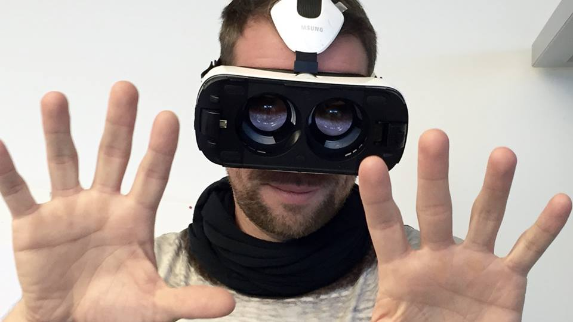

Leo Burnett Germany
===================

We are some random advertising guys from the Leo Burnett office in Frankfurt am Main, Germany.

The Team
--------

#### Viktor Kislovskij
Still waiting for the white rabbit. Meanwhile Viktor is working as a Creative Technologist in Frankfurt am Main with lasers and drones. Because everybody love lasers and drones, he says.

#### Philipp Trübiger
Every team needs a curly hair digital all-in-one dude. Otherwise they fail.

#### Laura Weber
“This is serious! We have no more chocolate.”. Chocolate is indeed the only thing that helps when you are studying these terms.

#### Helge Kniess

Our Submission
--------------

No one reads the fine print - because major online services don't want you to read them. The internet is a really scary place if you are aware of what you agreed on. We need to change that. By offering transparent overviews of what the terms really are – implemented directly into the registration process. By doing so we force online platforms to change something about their fine print. So that in future you don't need to accept “basically everything”.

Visit our project at https://leegl.org
